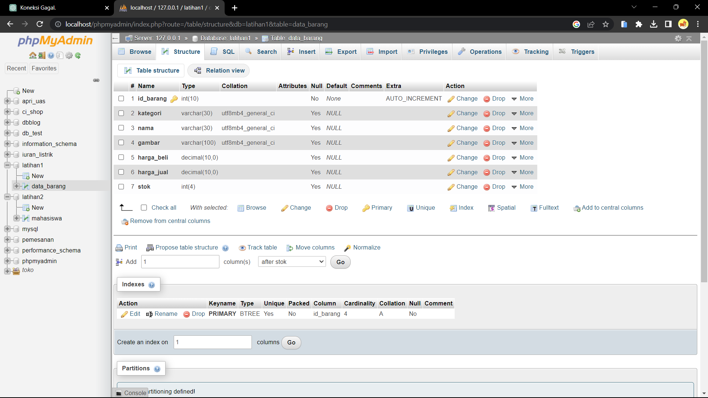
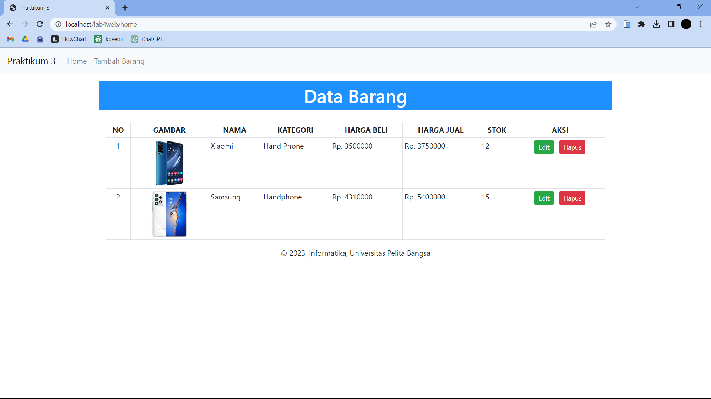
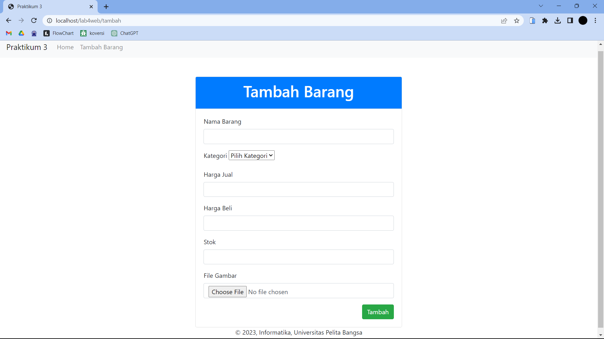
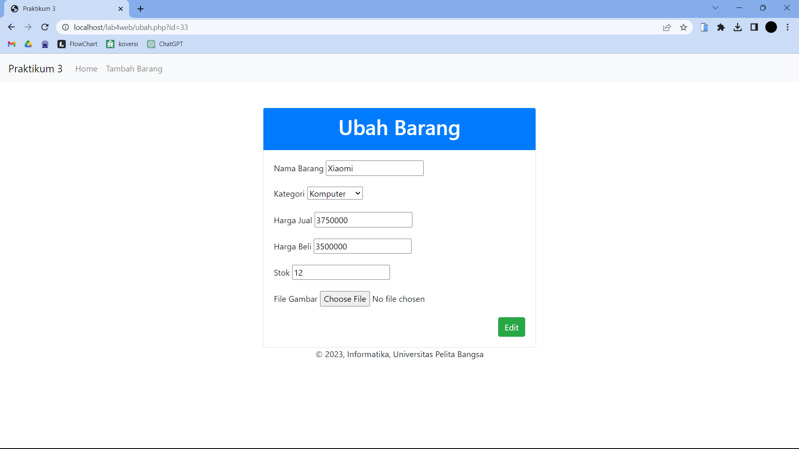
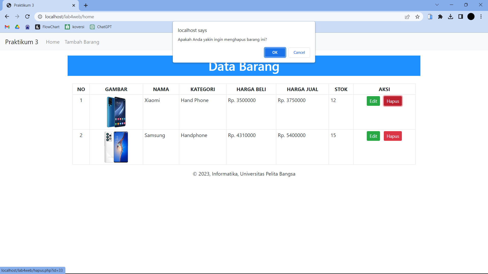
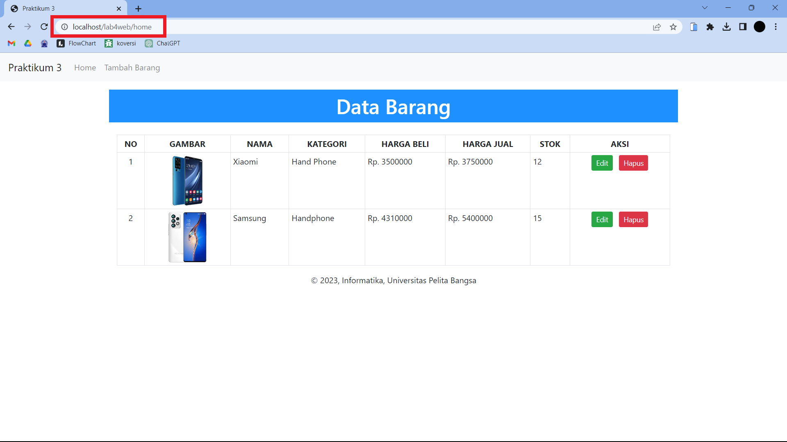
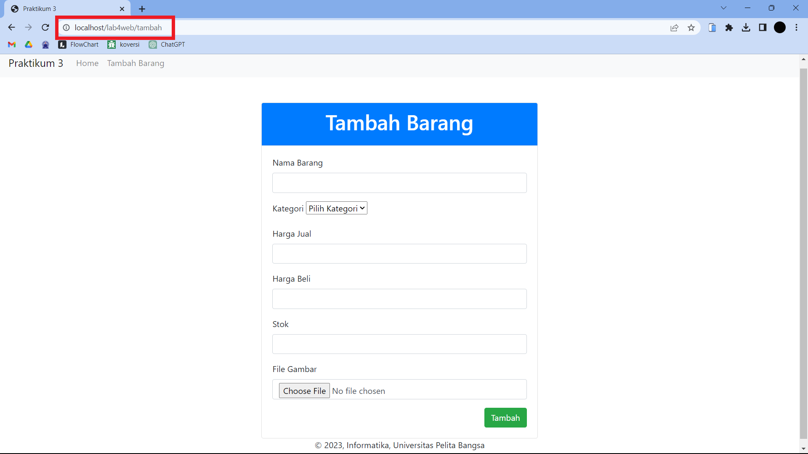

# Tugas Program Lab 4 Web

## Pertama Membuat koneksi.php

```php
<?php
$host = "localhost";
$user = "root";
$pass = "";
$db = "latihan1";
$conn = mysqli_connect($host, $user, $pass, $db);
if ($conn == false) {
  echo "Koneksi ke server gagal.";
  die();
} #else echo "Koneksi berhasil";

```

<br>
- Kode di atas adalah script PHP yang melakukan koneksi ke server database MySQL menggunakan fungsi mysqli_connect(). Variabel $host berisi nama server database, $user berisi username untuk mengakses database, $pass berisi password untuk mengakses database, dan $db berisi nama database yang akan digunakan.

<br>

- ### contoh database yang dibuat

  

<br>
<br>

## Home.php // Home



<br>

- Dilakukan pemanggilan file koneksi.php yang berisi script untuk koneksi ke database. Selanjutnya, dilakukan query untuk menampilkan data barang dari tabel data_barang menggunakan mysqli_query.
- Terdapat tombol "Tambah Barang" yang mengarahkan ke halaman tambah.php untuk menambahkan data baru. Pada kolom Aksi, terdapat tombol "Edit" dan "Hapus" yang mengarahkan ke halaman ubah.php dan hapus.php masing-masing. Tombol "Hapus" memiliki konfirmasi agar pengguna memastikan sebelum menghapus data.

```php
<?php
include_once 'header.php'; // Memanggil file header.php

include_once 'koneksi.php'; // Memanggil file koneksi.php

$sql = 'SELECT * FROM data_barang'; // Query untuk menampilkan semua data barang
$result = mysqli_query($conn, $sql);
$no = 1;

?>

<body>
  <h1
    class="py-2 px-3 text-center"
    style="background-color: #1E90FF; color: white;"
  >
    Data Barang
  </h1>

  <div class="container">
    <div class="mt-4">
      <table class="table table-sm table-bordered">
        <tr class="text-center fw-bold text-uppercase">
          <th>No</th>
          <th>Gambar</th>
          <th>Nama</th>
          <th>Kategori</th>
          <th>Harga Beli</th>
          <th>Harga Jual</th>
          <th>Stok</th>
          <th>Aksi</th>
        </tr>
        <?php while ($row = mysqli_fetch_assoc($result)) { ?>
        <tr>
          <td class="text-center">
            <?php echo $no;
                                                $no++ ?>
          </td>
          <td class="text-center">
            "
              alt="<?= $row['nama']; ?>"
              width="100px"
            />
          </td>
          <td><?php echo $row['nama']; ?></td>
          <td><?php echo $row['kategori']; ?></td>
          <td>
            Rp.
            <?php echo $row['harga_beli']; ?>
          </td>
          <td>
            Rp.
            <?php echo $row['harga_jual']; ?>
          </td>
          <td><?php echo $row['stok']; ?></td>
          <td class="text-center">
            <a
              href="ubah.php?id=<?php echo $row['id_barang']; ?>"
              class="btn btn-success btn-sm mx-1"
              >Edit</a
            >
            <a
              href="hapus.php?id=<?php echo $row['id_barang']; ?>"
              class="btn btn-danger btn-sm mx-1"
              onclick="return confirm('Apakah Anda yakin ingin menghapus barang ini?')"
              >Hapus</a
            >
          </td>
        </tr>
        <?php } ?>
      </table>
    </div>
  </div>
</body>

<?php include_once 'footer.php'; // Memanggil file footer.php
?>
```

<br>
<br>

## Form Tambah.php

  

  <br>

- Sintax ini merupakan sebuah form untuk menambahkan data barang ke dalam database. Pada saat form dikirimkan (submit), data yang dimasukkan oleh pengguna akan diolah terlebih dahulu dan kemudian dimasukkan ke dalam database.

```php
<?php

include_once 'header.php'; // Memanggil file header.php

include_once 'koneksi.php'; // Memanggil file koneksi.php

error_reporting(E_ALL);

class Barang
{
    private $conn;

    public function __construct($conn)
    {
        $this->conn = $conn;
    }

    public function tambahBarang($input)
    {
        $nama = ucwords(strtolower($input->nama));
        $kategori = ucwords(strtolower($input->kategori));
        $harga_beli = $input->harga_beli;
        $harga_jual = $input->harga_jual;
        $stok = $input->stok;
        $file_gambar = $_FILES['file_gambar'];
        $gambar = NULL;

        if ($file_gambar['error'] == 0) {
            $nama_gambar = str_replace(' ', '_', $file_gambar['name']);
            $path = dirname(__FILE__) . '/gambar/' . $nama_gambar;

            if (move_uploaded_file($file_gambar['tmp_name'], $path)) {
                $gambar = $nama_gambar;
            }
        }

        $sql = 'INSERT INTO data_barang (nama, kategori, harga_jual, harga_beli, stok, gambar) ';
        $sql .= "VALUE ('{$nama}', '{$kategori}','{$harga_jual}', '{$harga_beli}', '{$stok}', '{$gambar}')";
        $result = mysqli_query($this->conn, $sql);

        return $result;
    }
}


if (isset($_POST['submit'])) {
    $barang = new Barang($conn);
    $result = $barang->tambahBarang((object) $_POST);
    if ($result) {
        header('location: home');
    }
}

?>

<body>
    <div class="container">
        <div class="row mt-5">
            <div class="col-md-6 mx-auto">
                <div class="card">
                    <div class="card-header bg-primary text-white text-center">
                        <h1>Tambah Barang</h1>
                    </div>
                    <div class="card-body">
                        <form method="post" action="tambah.php" enctype="multipart/form-data">
                            <div class="mb-3">
                                <label for="nama" class="form-label">Nama Barang</label>
                                <input type="text" class="form-control" id="nama" name="nama" />
                            </div>
                            <div class="mb-3">
                                <label for="kategori" class="form-label">Kategori</label>
                                <select class="form-select" id="kategori" name="kategori">
                                    <option selected disabled>Pilih Kategori</option>
                                    <option value="Komputer">Komputer</option>
                                    <option value="Elektronik">Elektronik</option>
                                    <option value="Handphone">Handphone</option>
                                </select>
                            </div>
                            <div class="mb-3">
                                <label for="harga_jual" class="form-label">Harga Jual</label>
                                <input type="text" class="form-control" id="harga_jual" name="harga_jual" />
                            </div>
                            <div class="mb-3">
                                <label for="harga_beli" class="form-label">Harga Beli</label>
                                <input type="text" class="form-control" id="harga_beli" name="harga_beli" />
                            </div>
                            <div class="mb-3">
                                <label for="stok" class="form-label">Stok</label>
                                <input type="text" class="form-control" id="stok" name="stok" />
                            </div>
                            <div class="mb-3">
                                <label for="file_gambar" class="form-label">File Gambar</label>
                                <input type="file" class="form-control" id="file_gambar" name="file_gambar" />
                            </div>
                            <div class="d-grid gap-2 d-md-flex justify-content-md-end">
                                <button class="btn btn-success" name="submit" type="submit">Tambah</button>
                            </div>
                        </form>
                    </div>
                </div>
            </div>
        </div>
    </div>
</body>

<?php include_once("footer.php")  // Memanggil file footer.php
?>
```

<br>
<br>

## Form Ubah.php



<br>

- Sintax ini merupakan sebuah form untuk mengubah data barang yang telah tersimpan dalam database. Pertama, dilakukan koneksi ke database menggunakan file koneksi.php. Kemudian dilakukan pengecekan apakah form telah di-submit menggunakan isset($\_POST['submit']). Jika ya, maka dilakukan proses update data barang dengan mengambil nilai-nilai form dan mengganti data lama di database dengan yang baru. Gambar barang yang diunggah akan diubah dengan menggunakan fungsi move_uploaded_file. Jika tidak ada gambar yang diunggah, maka gambar akan tetap menggunakan gambar lama.

  ```php
  include_once 'header.php'; // Memanggil file header.php
  include_once 'koneksi.php'; // Memanggil file koneksi.php
  error_reporting(E_ALL);
  if (isset($_POST['submit'])) {
    $id = $_POST['id'];
    $nama = $_POST['nama'];
    $kategori = $_POST['kategori'];
    $harga_jual = $_POST['harga_jual'];
    $harga_beli = $_POST['harga_beli'];
    $stok = $_POST['stok'];
    $file_gambar = $_FILES['file_gambar'];
    $gambar = null;

    if ($file_gambar['error'] == 0) {
        $filename = str_replace(' ', '_', $file_gambar['name']);
        $destination = dirname(__FILE__) . '/gambar/' . $filename;
        if (move_uploaded_file($file_gambar['tmp_name'], $destination)) {
            $gambar = '' . $filename;;
        }
    }
    $sql = 'UPDATE data_barang SET ';
    $sql .= "nama = '{$nama}', kategori = '{$kategori}', ";
    $sql .= "harga_jual = '{$harga_jual}', harga_beli = '{$harga_beli}', stok = '{$stok}' ";
    if (!empty($gambar))
        $sql .= ", gambar = '{$gambar}' ";
    $sql .= "WHERE id_barang = '{$id}'";
    $result = mysqli_query($conn, $sql);
    header('location: home');
    }
    $id = $_GET['id'];
  $sql = "SELECT * FROM data_barang WHERE id_barang = '{$id}'";
  $result = mysqli_query($conn, $sql);
  if (!$result) die('Error: Data tidak tersedia');
  $data = mysqli_fetch_array($result);
  function is_select($var, $val)
  {
    if ($var == $val) return 'selected="selected"';
    return false;
  }
  ?>

  <body>
    <div class="container">
        <div class="row mt-5">
            <div class="col-md-6 mx-auto">
                <div class="card">
                    <div class="card-header bg-primary text-white text-center">
                        <h1>Ubah Barang</h1>
                    </div>
                    <div class="card-body">
                        <form method="post" action="ubah.php" enctype="multipart/form-data">
                            <div class="mb-3">
                                <label>Nama Barang</label>
                                <input type="text" name="nama" value="<?php echo
                                                                        $data['nama']; ?>" />
                            </div>
                            <div class="mb-3">
                                <label>Kategori</label>
                                <select name="kategori">
                                    <option <?php echo is_select('Komputer', $data['kategori']); ?> value="Komputer">Komputer</option>
                                    <option <?php echo is_select('Elektronik', $data['kategori']); ?> value="Elektronik">Elektronik</option>
                                    <option <?php echo is_select('Handphone', $data['kategori']); ?> value="Handphone">Handphone</option>
                                </select>
                            </div>
                            <div class="mb-3">
                                <label>Harga Jual</label>
                                <input type="text" name="harga_jual" value="<?php echo
                                                                            $data['harga_jual']; ?>" />
                            </div>
                            <div class="mb-3">
                                <label>Harga Beli</label>
                                <input type="text" name="harga_beli" value="<?php echo
                                                                            $data['harga_beli']; ?>" />
                            </div>
                            <div class="mb-3">
                                <label>Stok</label>
                                <input type="text" name="stok" value="<?php echo
                                                                        $data['stok']; ?>" />
                            </div>
                            <div class="mb-3">
                                <label>File Gambar</label>
                                <input type="file" name="file_gambar" />
                            </div>
                            <div class="submit">
                                <input type="hidden" name="id" value="<?php echo
                                                                        $data['id_barang']; ?>" />
                            </div>
                            <div class="d-grid gap-2 d-md-flex justify-content-md-end">
                                <button class="btn btn-success" name="submit" type="submit" onclick="return confirm('Apakah Anda yakin ingin mengubah barang ini?')">
                                    Edit
                                </button>
                            </div>
                        </form>
                    </div>
                </div>
            </div>
        </div>
    </div>
  </body>
  <?php include_once 'footer.php'; // Memanggil file footer.php
  ?>
  ```

<br>
<br>

## Form Hapus.php



<br>

- Sintas ini merupakan script PHP untuk menghapus data pada tabel "data_barang" berdasarkan ID tertentu yang diterima dari parameter GET. Koneksi ke database diatur dengan menggunakan file "koneksi.php". Kemudian, sebuah query SQL dijalankan dengan menggunakan fungsi "mysqli_query()" untuk menghapus data berdasarkan ID yang diterima. Setelah itu, pengguna akan dialihkan kembali ke halaman "index.php" dengan menggunakan fungsi "header()".

```php
<?php
include_once 'koneksi.php';
$id = $_GET['id'];
$sql = "DELETE FROM data_barang WHERE id_barang = '{$id}'";
$result = mysqli_query($conn, $sql);
header('location: home');
?>
```

<br>
<br>

## Membuat Routing

- Routing digunakan untuk mempermudah akses halaman web agar SEO Friendly. Langkah awal adalah menyiapkan file utama index.php yang berisi routing untuk mengakses banyak halaman.

  Contohnya :

- Halaman Home ( http://localhost/lab4web/index.php?mod=home )
- Halaman Tambah ( http://localhost/lab4web/index.php?mod=tambah )

```php
<?php

$mod = @$_REQUEST['mod'];

switch ($mod) {
    case "home":
        require("home.php");
        break;
    case "tambah":
        require("tambah.php");
        break;
    default:
        require("home.php");
}

```

<br>
<br>

## Membuat mod_rewrite (.htaccess)

- Mod_rewrite digunakan untuk mengubah URL dari query string menjadi SEO Friendly. Kemudian membuat file .htaccess, kemudian simpan ke dalam folder lab4web.

```
<IfModule mod_rewrite.c>
RewriteEngine On
RewriteBase /lab4web/
RewriteCond %{REQUEST_FILENAME} !-f
RewriteCond %{REQUEST_FILENAME} !-d
RewriteRule ^(.*)$ index.php?mod=$1 [L]
</IfModule>
```

- Hasilnya akan menjadi :

  - Halaman Home (http://localhost/lab4web/home):\
    <br>
    

    <br>

  - Halaman Tambah (http://localhost/lab4web/tambah):

    <br>
    

# TERIMAKASIH
